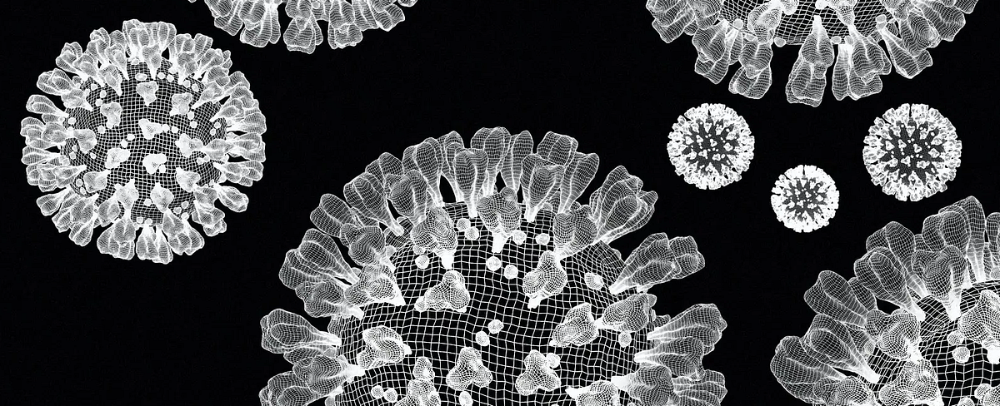

<!--  -->

_Expert insights on managing new COVID symptoms. Discover effective treatments, natural remedies, and lifestyle tips for swift recovery._

### Preface

As the COVID pandemic continues to evolve, so do its symptoms. Although not more severe, the new variant JN.1 brings new challenges. Understanding and managing these symptoms effectively is vital to a quick recovery. This article comprehensively combines conventional medicines, natural remedies, and lifestyle modifications.

### Take Action

Staying informed and prepared is crucial in addressing the new COVID variant JN.1 and its symptoms. JN.1 has recently become the dominant variant, and while it's not associated with increased risk or severity compared to other variants, caution is always advisable [1].

Symptoms of the JN.1 variant include fever, chills, shortness of breath, fatigue, headache, muscle or body aches, loss of taste or smell, sore throat, congestion, runny nose, nausea and vomiting, and diarrhea [2]. .

For treating these symptoms, especially in the context of the JN.1 variant, a combination of conventional medicines, natural remedies, and lifestyle modifications can be effective. Here's a comprehensive approach.

> **Explore More:** Visit our Linktree for resources and social updates.

> **Support Us/Disclosure:** As an Amazon Affiliate, we earn from qualifying purchases at no extra cost to you. I'm not a doctor; however, this was written based on doctor-inspired advice.

> **Stay Updated:** Subscribe to our newsletter for more curated _health_, _wealth_, and _relationships_ content.

#### Conventional Medicines

1. Antipyretics: Medications like acetaminophen or ibuprofen are recommended for fever and aches.
2. Decongestants: To alleviate congestion and runny nose.
3. Antihistamines: Effective for allergy-like symptoms.

#### Natural Remedies and Supplements

1. Vitamin C and Zinc: Boost the immune system.
2. Honey and Lemon: Soothe sore throat and cough.
3. Ginger and Turmeric: Known for anti-inflammatory properties.

#### Lifestyle Modifications

1. Stay Hydrated: Drink plenty of fluids.
2. Rest: Ensure adequate sleep.
3. Healthy Diet: Focus on a balanced diet rich in nutrients.

### Success Story

A 47-year-old individual with mild JN.1 symptom followed a regime of hydration, rest, and a balanced diet supplemented with vitamin C and zinc [3]. They reported significant improvement in a week by taking Zicam.

---

### FAQs: New COVID Symptoms

**Q: What are the new symptoms of the COVID variant JN.1?** A: Symptoms include fever, chills, shortness of breath, and more.

**Q: Can natural remedies be effective against these symptoms?** A: Yes, natural remedies can help alleviate symptoms and boost immunity.

**Q: Should I consult a doctor for these symptoms?** A: Consulting a healthcare professional is advisable for severe or persistent symptoms.

---

_Remember, this information is not a substitute for professional medical advice. Always consult a healthcare provider for personalized treatment._

#### Pay It Forward 🌟

> Enjoyed the article? 📥 👍💬  
> Discover the power of 50 👏's  
> Please consider showing your appreciation by giving us a tip on Ko-fi ☕ ️🎉. Your support helps us keep the content flowing!
