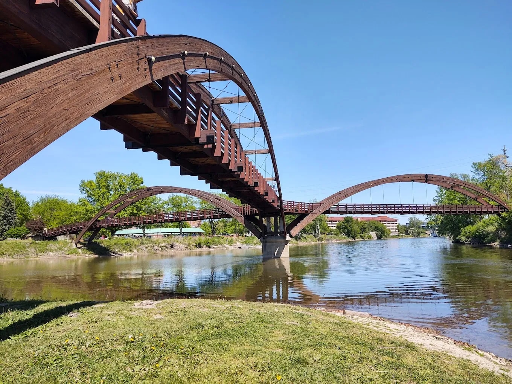

<!--  -->

_An extension to my "About Me" post_

## Intro

This weekend, I traveled to Midland, Michigan, my hometown. On the way up there (from Cincinnati), I stayed the night in Flint   —  yes, it's safe to drink the water there.

While I eventually made my way to Midland, I couldn't help but think about how difficult it has been for Flint and the residents to endure several cascading crises. Even Midland had an unexpected flood in the downtown area.

Growing up there, we never experienced such traumatic events, at least from what I recall.

It was nice to escape from the daily routine and I gained a fresh perspective, even if only for a few days. It's a lot of driving and ample time to think about the **past**, **present**, and _potential future_.

## Reset

Life is short. What I noticed up there is that some areas, like the highways, for instance, were always in a rush. For example, I'm going 79, getting passed on both sides like I'm practically in the way!

Once in town, life moved _much slower_ than I experienced in Cincinnati.

> I don't want to be in a hurry all the time.

It's been a challenging year.

I'm still searching for a good fit for full-time employment (tech layoffs). Still, this self-reflection trip reminded me starkly that starting my own side business is imperative if I'm ever to replace a typical 9 – 5 hamster wheel.

## 9 – 5 Unexpectedly Empheril

Not having full-time has been financially devastating, and the consistent benefits were very nice to count on. However, in the blink of an eye over a rando zoom call, it's blazed up   —  completely gone like it never happened.

> Setting my **own** schedule and managing my destiny is central to my newfound life goal.

## Details

I've been experimenting with alternative income streams, most of which could have been more successful than I hoped. Shortly before the trip, I arrived at a sobering realization.

While scrambling to find my "niche," my chance to zero in on something becomes more difficult. Here is what I learned the hard way and what I plan to do:

- Don't spread yourself too thin, and don't attempt too many endeavors all at once; it's not realistic.
- Don't get hung up on specific advice, saying if you do this one thing, you will get x.
- Avoid niches you aren't crazy about (despite what some tool says could be profitable and easy   —  nothing is sustainable if you don't want to do it).
- Only invest a little education in this decaying economy, as it could come back to bite you hard in the near future.
- Continue exploring as you discover areas that could be enjoyable but not profitable; don't abandon them completely   —  deprioritize.
- Challenge yourself with something new _even_ if you have low confidence in your success.

## Ahead

I will continue contributing to my Wayfinder site and publication in a limited capacity while it's still something I like doing.

The new pivot for me will be freelancing while building my new brand and authority in my target niche.

> I'll continue sharing ideas and solutions with my potential readers, which will be more centered around the topic to keep people visiting and informed.
>
> Wish me luck! Feel free to **comment** with ideas or questions about my new focus.

> So say we all!
