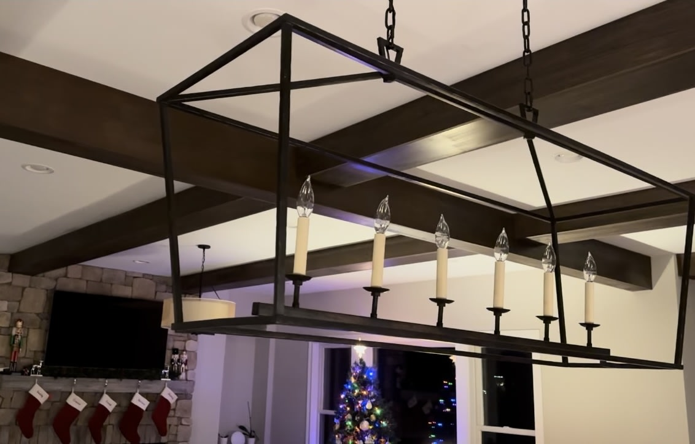

<!--  -->

## It's About the Details

In the same way that a gentle rain provides life to a dry region, the correct lighting may do the same for a room.

📔 Regarding home décor, lighting is more than a practical need; it's also an opportunity to express one's style and create an atmosphere.

Introducing the JONATHAN Y JYL7439A Pagoda Lantern, a shining example of timeless beauty and contemporary utility, ready to perfectly balance the two to your home.

## A Hint of Timeless Elegance

A perfect illustration of how traditional style may coexist with modern furnishings is the Pagoda Lantern by JONATHAN Y.

The elegance and grace of a bygone age are echoed in its oil-rubbed bronze finish, which gives off an air of classic beauty.

This metal pendant lamp has a lantern shape that makes one think of old pagodas; it will provide a touch of mystery and traditional flair to any space.

Still, it's more than a passing reference to the past. The Pagoda Lantern brings the past and present with its timeless design that speaks to contemporary tastes.

It's ideal for modern people who love classic style yet prefer to live in the present.

## Excellence Demonstrated by Quality and Durability

🤩 Like all JONATHAN Y products, the Pagoda Lantern is of the highest quality.

We put it through a battery of tests to guarantee that every light fixture lives up to our exacting standards for quality and performance. This pendant, crafted from durable metal, exemplifies the brand's dedication to quality.

## Bringing Energy-Efficient Light into Your Home

Nowadays, energy efficiency is seen as an absolute must, and the Pagoda Lantern is at the forefront of this movement.

Including energy-efficient LED lights is a win for the planet and common sense.

The lantern is beautiful and economical thanks to these bulbs, which last longer and use less energy than regular light bulbs.

## A Universally Appealing Design

The adaptability of the Pagoda Lantern is its defining feature.

This pendant will be the perfect addition, thanks to its flexible chain link, whether you have a small apartment or a large mansion.

It would look great in any space that needs more class, like the kitchen, living room, dining room, bedroom, entryway, or hallway.

## The JONATHAN Y Promise to Satisfy

Soho, New York, is home to designer Jonathan and his crew, who are hell-bent on making great home decor accessible to everyone.

Crafted with meticulous attention to detail, every JONATHAN Y design is more than just a light fixture — an artwork.

> The Pagoda Lantern exemplifies this dedication to design and quality since it is UL and ETL Listed.

## An Elegant and Illuminating Symphony

The Pagoda Lantern is an eye-catching centerpiece that deftly blends into its surroundings, casting a warm and refined glow.

ts timeless elegance and practicality make it an excellent pick for anyone who likes to add a little bit of modern style to their home.

Just like rain nurtures the environment, the JONATHAN Y Pagoda Lantern may provide a touch of beauty and grace to your house by illuminating it.

ℹ ️ For more information and to purchase the JONATHAN Y Pagoda Lantern, visit the product page at Amazon today. Illuminate your space with elegance and style!

## FAQ

#### \***\*What style is the JONATHAN Y Pagoda Lantern?\*\***

The JONATHAN Y Pagoda Lantern features a classic, traditional style with a lantern-like design. It fits well in farmhouse, classic, and traditional interior themes.

#### \***\*What material is the Pagoda Lantern made of?\*\***

The Pagoda Lantern is crafted from high-quality metal, ensuring durability and longevity.

#### \***\*What color is the Pagoda Lantern?\*\***

This pendant light comes in an elegant oil-rubbed bronze color, offering a timeless and sophisticated look.

#### \***\*Is the JONATHAN Y Pagoda Lantern easy to install?\*\***

Yes, customers rate its ease of installation highly. However, professional installation is recommended to ensure safety and optimal performance.

#### \***\*Are LED bulbs included with the Pagoda Lantern?\*\***

Yes, energy-saving LED bulbs are included with every light fixture, making it an energy-efficient choice.

#### \***\*Is the height of the Pagoda Lantern adjustable?\*\***

Absolutely! The fixture comes with an adjustable chain link, making it suitable for various ceiling heights and spaces.

#### \***\*What are the safety standards of the Pagoda Lantern?\*\***

The JONATHAN Y Pagoda Lantern is ETL Listed and meets 120-volt UL standards for safety and quality.

#### \***\*What type of rooms is the Pagoda Lantern suitable for?\*\***

It's perfect for dining rooms, living rooms, kitchens, foyers, bedrooms, and hallways, adding elegance and style to any space.

#### \***\*How does the JONATHAN Y brand ensure product quality?\*\***

JONATHAN Y is known for its uncompromising attention to detail and uses only high-quality components in its designs. Each product undergoes rigorous quality checks.

#### \***\*Where is JONATHAN Y based, and what is their design philosophy?\*\***

Based in Soho, New York, JONATHAN Y and its talented team focus on creating affordable, high-end home decor that combines classic elegance with modern functionality.

#### \***\*How do customers rate the value for money of the Pagoda Lantern?\*\***

The Pagoda Lantern has received high ratings for value for money, indicating customer satisfaction with the quality and price of the product.

#### \***\*Can the Pagoda Lantern be used in commercial settings?\*\***

While primarily designed for home use, its classic design and quality construction make it suitable for select commercial environments as well.

## Compliance, Guidelines, and Acknowledgements

- **\*Affiliate Disclosure:** As a participant in the Amazon Affiliate Program, I earn from qualifying purchases made through links provided in this content. This means if you click on a link and make a qualifying purchase, I may receive a commission at no additional cost to you. Thank you for supporting my work and allowing me to bring you valuable insights!\*
